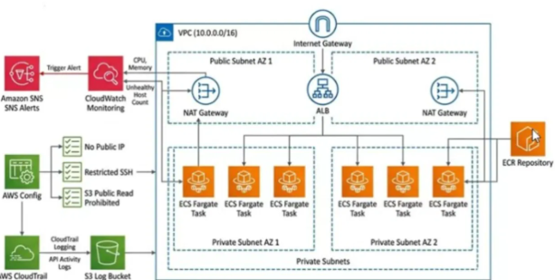

# CINDER — Dockerized Web App on AWS ECS Fargate

A production-pattern, highly available deployment of a Dockerized static web application on AWS — built manually end-to-end to practice real cloud architecture, networking, container orchestration, monitoring, compliance, and audit logging.


## Architecture



Internet → **ALB** (public subnets, 2 AZs) → **ECS Fargate tasks** (private subnets, 2 AZs, never internet-exposed) — with **CloudWatch/SNS** alerting, **AWS Config** compliance rules, and **CloudTrail** audit logging wrapped around the whole thing.

## What This Project Demonstrates

- **Networking**: Custom VPC (10.0.0.0/16), public/private subnet split across 2 Availability Zones, per-AZ NAT Gateways for HA, correctly scoped route tables
- **Containers**: Docker image built from an nginx base, pushed to a private, scan-on-push ECR repository
- **Compute**: Serverless containers on ECS Fargate — no EC2 instances to patch or manage, self-healing task replacement, zero-downtime deploys
- **Load Balancing**: Application Load Balancer with IP-type target groups (the correct target type for Fargate's `awsvpc` networking mode)
- **Security**: Security groups scoped so Fargate tasks only accept traffic from the ALB — never directly reachable from the internet
- **Observability**: CloudWatch Container Insights, custom alarms (CPU utilization, ALB unhealthy host count) wired to SNS email alerts
- **Compliance**: AWS Config with managed rules continuously checking for public IPs, open SSH, and public S3 buckets
- **Audit**: Multi-region CloudTrail with log file validation for a tamper-evident record of every API call

## Tech Stack

| Layer | Service/Tool |
|---|---|
| Container | Docker, nginx:1.27-alpine |
| Registry | Amazon ECR |
| Compute | AWS ECS (Fargate) |
| Networking | AWS VPC, NAT Gateway, Internet Gateway, Route Tables |
| Load Balancing | Application Load Balancer |
| Monitoring | CloudWatch, SNS |
| Compliance | AWS Config |
| Audit | AWS CloudTrail |

## Repository Structure

```
.
├── Dockerfile                          # Container build definition
├── index.html                          # Static site (served by nginx)
├── README.md                           # This file
└── docs/
    ├── architecture-diagram.png        # Target architecture diagram
    
```

## Running Locally

```bash
docker build -t cinder-web .
docker run --rm -p 8080:80 cinder-web
```
Then open `http://localhost:8080`.

## Deploying to AWS

## Deploying to AWS

The deployment order was: VPC → ECR → ALB → ECS Fargate → Monitoring → Config → CloudTrail.

Along the way I hit and resolved several real-world issues — target group type mismatches, IAM permission errors, and S3 bucket policy failures among them.

## Known Simplifications

This build intentionally kept a few things simple for a learning/demo pass — noted here for transparency rather than presented as finished production hardening:

- No HTTPS/TLS listener on the ALB (HTTP only)
- Broad IAM policies on the setup user rather than least-privilege scoping
- No automated remediation wired to AWS Config findings (detection only)
- Manual console build — no Terraform/IaC or CI/CD pipeline in this pass (planned as a next iteration)

## Author

Built by Ananthapadmanabhan.G as a hands-on AWS cloud architecture project.
